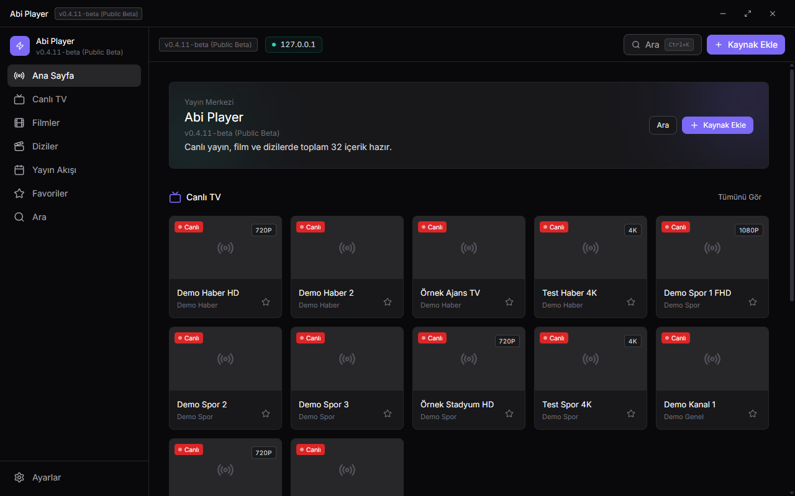
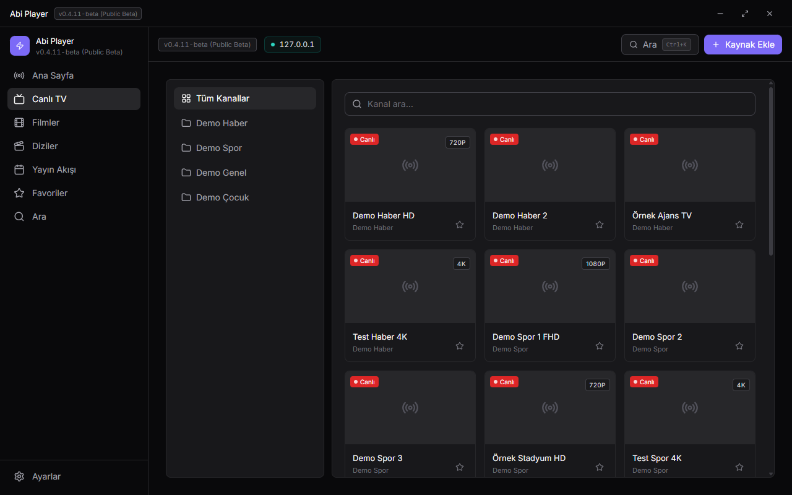
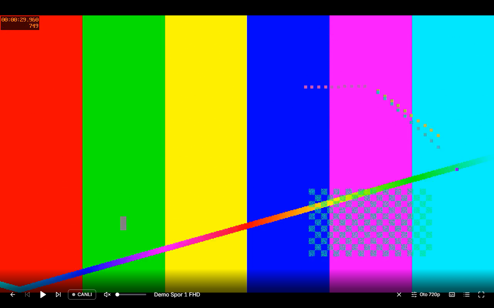
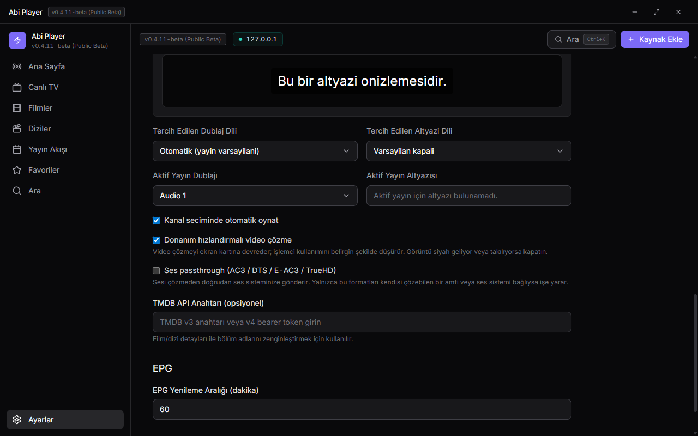

<div align="center">

# Abi Player

**Masaüstü için modern, hızlı ve açık kaynak IPTV oynatıcı**

Xtream Codes ve M3U kaynaklarıyla çalışır. Oynatma çekirdeği olarak MPV'yi kullanır ve donanım hızlandırmalı video çözmeyi destekler.

[](https://github.com/enesbsafak/AbiPlayer/releases/latest)
[](https://github.com/enesbsafak/AbiPlayer/releases)
[](https://github.com/enesbsafak/AbiPlayer/issues)


[**İndir**](https://github.com/enesbsafak/AbiPlayer/releases/latest) · [Özellikler](#özellikler) · [Kurulum](#kurulum) · [Geliştirme](#geliştirme)

</div>

---

## Ekran Görüntüleri

<table>
  <tr>
    <td width="50%"></td>
    <td width="50%"></td>
  </tr>
  <tr>
    <td><b>Ana sayfa</b> — kaynaklarındaki içeriğe tek ekrandan erişim</td>
    <td><b>Canlı TV</b> — kategoriler, kalite bilgisi, favoriler</td>
  </tr>
  <tr>
    <td></td>
    <td></td>
  </tr>
  <tr>
    <td><b>Oynatıcı</b> — MPV tabanlı, pencereye gömülü oynatma</td>
    <td><b>Ayarlar</b> — oynatma, ses ve altyazı tercihleri</td>
  </tr>
</table>

> Ekran görüntülerindeki tüm kanal adları ve görüntüler tanıtım amacıyla üretilmiştir. Gerçek bir yayın, kanal veya sağlayıcı içermez.

---

## Yasal Uyarı ve Sorumluluk Reddi

Abi Player yalnızca genel amaçlı bir medya oynatıcıdır.

- Uygulama herhangi bir TV kanalı, film, dizi veya canlı yayın **sağlamaz**, **satmaz**, **dağıtmaz** ve **barındırmaz**.
- Uygulama ile açılan tüm içerikler, kullanıcının kendi eklediği üçüncü taraf kaynaklardan gelir.
- Kullanıcı, kullandığı tüm kaynakların ve yayınların kendi ülkesindeki yasalara uygun olduğunu doğrulamaktan sorumludur.
- Telif hakkı ihlali oluşturabilecek kullanımlardan yalnızca kullanıcı sorumludur.
- Proje sahipleri ve geliştiricileri, kullanıcının eklediği kaynaklar veya oynattığı içerikler nedeniyle doğrudan ya da dolaylı yasal sorumluluk kabul etmez.
- Uygulama "olduğu gibi" sunulur; belirli bir amaca uygunluk, kesintisiz çalışma veya hatasızlık konusunda açık ya da örtülü garanti verilmez.
- Bu bildirim bilgilendirme amaçlıdır, hukuki danışmanlık yerine geçmez.

---

## Kurulum

### Kullanıcılar için

[**Releases sayfasından**](https://github.com/enesbsafak/AbiPlayer/releases/latest) `abi-player-*-setup.exe` dosyasını indirip çalıştırın. Kurulum kullanıcı bazlıdır, yönetici izni istemez.

MPV oynatma çekirdeği kuruluma dahildir — ayrıca bir şey yüklemeniz gerekmez.

Uygulama yeni sürümleri kendisi kontrol eder ve yalnızca değişen kısımları indirir.

### Beta durumu

Proje **public beta** aşamasındadır. Karşılaşabileceğiniz durumlar:

- Bazı sağlayıcılarda ilk tarama uzun sürebilir
- Sağlayıcıya özel API farklarından kaynaklı uyumsuzluklar
- Arayüzde düzeltilmeyi bekleyen kenar durumlar

Hata bildirimleri bu aşamada kritik önemde. [Issue açarken](https://github.com/enesbsafak/AbiPlayer/issues) tekrar üretme adımlarını yazmanız çok yardımcı olur.

---

## Özellikler

### Kaynaklar

- **Xtream Codes API** — Canlı TV, Film (VOD) ve Dizi
- **M3U / M3U8** — URL veya yerel dosyadan içe aktarma
- Birden fazla kaynağı aynı anda kullanma
- Açılışta kaynaklara otomatik yeniden bağlanma
- Kimlik bilgileri işletim sisteminin güvenli deposunda şifreli tutulur, düz metin olarak saklanmaz

### Oynatma

- **MPV tabanlı gömülü oynatma** — ayrı pencere açılmaz, oynatıcı uygulamanın içindedir
- **Donanım hızlandırmalı video çözme** — video çözme ekran kartına devredilir; 1080p50 HEVC ölçümünde işlemci kullanımı %24,7'den %4,9'a düştü
- **Ses passthrough** — AC3, DTS, E-AC3 ve TrueHD sesi çözmeden doğrudan amfiye gönderir (varsayılan kapalı)
- HTML5 / HLS yedek oynatma yolu
- Canlı yayınlarda kesinti sonrası otomatik yeniden bağlanma
- Kanal listesi oynatıcı üzerinde açılır; görüntü panelin altında kalmaz, yanına daralır

### Ses ve Altyazı

- Çoklu ses ve altyazı izi seçimi
- Yayın içine gömülü altyazıları bulma ve kullanma
- Harici altyazı dosyası yükleme — SRT, VTT, ASS, SSA
- Altyazı görünümü — boyut, renk, arka plan opaklığı
- Tercih edilen dublaj ve altyazı dili; uygun iz varsa kendiliğinden seçilir

### Katalog Düzeni

- **Sıralama** — Alfabetik (Türkçe, "TRT 2" < "TRT 10") veya kaynağın gönderdiği sıra
- **Yetişkin içerik listenin sonunda** — Her iki sıralama modunda da; kategori ve kanal adından tespit edilir
- **Kategori gizleme** — İstemediğiniz kategoriler listelerden tamamen çıkar; sol panelde tek tık, Ayarlar'da toplu yönetim

### Arayüz

- Favoriler, arama (`Ctrl+K`), mini oynatıcı
- EPG (XMLTV) yayın akışı
- TMDB ile film ve dizi detaylarını zenginleştirme (opsiyonel, kendi anahtarınızla)
- Klavye kısayolları

### Klavye Kısayolları

| Tuş                    | İşlev                        |
| ---------------------- | ---------------------------- |
| `Boşluk` / `K`         | Oynat / Duraklat             |
| `F`                    | Tam ekran                    |
| `M`                    | Sessize al                   |
| `↑` / `↓`              | Ses seviyesi                 |
| `←` / `→`              | Geri / ileri sarma           |
| `L`                    | Canlı yayına dön             |
| `Esc`                  | Tam ekrandan veya oynatıcıdan çık |
| `Ctrl+K`               | Arama                        |

---

## Oynatma Çekirdeği Notları

Abi Player, MPV'yi uygulamanın kendi penceresine gömerek kullanır.

### Donanım hızlandırma

Varsayılan olarak açıktır ve MPV'nin `auto-safe` kipini kullanır: yalnızca sorunsuz çalıştığı bilinen kod çözücüler devreye girer. Ekran kartının çözemediği formatlarda (örneğin 10-bit H.264 veya interlaced MPEG-2) uygulama kendiliğinden yazılım çözmeye geçer.

Donanım hızlandırma ekran kartı sürücüsüne bağlı çalışır. Siyah ekran, takılma veya görüntü bozulması yaşarsanız **Ayarlar → Oynatıcı → Donanım hızlandırmalı video çözme** seçeneğini kapatabilirsiniz; ayar anında etkili olur.

### Ses passthrough

Yalnızca AC3/DTS/E-AC3/TrueHD sesi kendisi çözebilen bir amfi veya ev sinema sistemi bağlıysa işe yarar. Varsayılan kapalıdır.

Açtığınızda uygulama her yayında geçişi doğrular: ses cihazınız gönderilen formatı kabul etmezse otomatik olarak normal ses çözmeye döner. Ayarlar ekranında o an kullanılıp kullanılmadığı gösterilir. Bu nedenle açık bırakmak bir yayını sessiz bırakma riski taşımaz.

### Özel MPV yolu

Windows kurulumunda MPV pakete dahildir. macOS ve Linux'ta `mpv` sistemde kurulu olmalıdır (PATH üzerinden aranır).

Farklı bir MPV kullanmak isterseniz `MPV_PATH` ortam değişkenini tanımlayabilirsiniz:

```powershell
$env:MPV_PATH="C:\path\to\mpv.exe"
npm run dev
```

---

## Kullanım Akışı

1. Uygulamayı açın.
2. **Ayarlar** sayfasından kaynak ekleyin — Xtream Codes, M3U URL veya M3U dosyası.
3. İlk bağlantı ve tarama tamamlanana kadar bekleyin.
4. Canlı TV / Filmler / Diziler bölümlerinden içerik seçip oynatın.
5. İsterseniz TMDB API anahtarı ekleyerek film ve dizi detaylarını zenginleştirin.

### Önbellek davranışı

İlk kaynak taraması, özellikle büyük Xtream sağlayıcılarında zaman alabilir. Tarama bittikten sonra veriler uygulama açık olduğu sürece bellekte tutulur. Kaynak silme veya yenileme durumunda ilgili önbellek temizlenir ve tarama yeniden tetiklenir.

---

## Teknoloji Yığını

| Katman        | Kullanılan                                            |
| ------------- | ----------------------------------------------------- |
| Masaüstü      | Electron 40, electron-vite 5, electron-builder 26     |
| Arayüz        | React 18, React Router 7, Tailwind CSS 3              |
| Dil           | TypeScript 5                                          |
| Durum yönetimi| Zustand 5 (persist middleware ile)                    |
| Oynatma       | MPV (JSON IPC üzerinden, pencereye gömülü), hls.js    |
| Medya araçları| ffmpeg-static, ffprobe-static (altyazı işlemleri)     |
| EPG           | fast-xml-parser (XMLTV)                               |
| Test          | Vitest                                                |
| Güncelleme    | electron-updater (fark tabanlı indirme)               |

---

## Geliştirme

### Gereksinimler

- Node.js **20+**
- npm **10+**
- Windows (aktif geliştirilen ve test edilen hedef)

### Başlangıç

```bash
git clone https://github.com/enesbsafak/AbiPlayer.git
cd AbiPlayer
npm install
npm run dev
```

### Komutlar

```bash
npm run dev            # Geliştirme (Electron + renderer, hot reload)
npm run typecheck      # TypeScript denetimi (main + renderer)
npm test               # Test paketi (Vitest)
npm run build          # Production build (typecheck dahil)
npm run build:unpack   # Paketlenmiş ama kurulum dosyası üretmeden derle
npm run build:win      # Windows kurulum dosyası
npm run release:win    # Derle, etiketle ve GitHub release'i yayınla
```

### Proje yapısı

```
src/
  main/        Electron ana süreç — MPV denetleyicisi, IPC, güncelleyici
  preload/     Yalıtılmış köprü (contextIsolation açık, sandbox açık)
  renderer/    React arayüzü — sayfalar, bileşenler, hook'lar, store
  shared/      İki taraf arasında paylaşılan tipler
resources/mpv/ Pakete dahil edilen MPV ikilisi (Windows)
docs/          Sürüm notları ve görseller
```

### Doğrulama

Değişiklik gönderirken şunların geçtiğinden emin olun:

```bash
npm run typecheck && npm test
```

Arayüz tarafında değişiklik yaptıysanız statik analiz puanının düşmediğini de kontrol edebilirsiniz:

```bash
npx react-doctor@latest --verbose --scope changed
```

> Not: Paketlenmiş uygulamada ortaya çıkan hatalar geliştirme ortamında görünmeyebilir. Alt süreç çalıştıran (MPV, ffmpeg, ffprobe) bir değişiklik yaptıysanız `npm run build:unpack` ile derleyip paketlenmiş kopyayı çalıştırarak doğrulayın.

---

## Bilinen Kısıtlar

- Büyük IPTV sağlayıcılarında ilk tarama süresi uzun olabilir.
- Sağlayıcı API kalitesine bağlı olarak bazı kategoriler eksik dönebilir.
- Donanım hızlandırma yalnızca NVIDIA ekran kartı üzerinde test edilmiştir; AMD ve Intel için saha geri bildirimi bekleniyor.
- Ses passthrough'un çalıştığı doğrulanmış bir amfi testi henüz yapılmamıştır; güvenli geri dönüş mekanizması doğrulanmıştır.
- HDR içerik doğru şekilde çözülür ve ekrana uygun biçimde dönüştürülür; HDR'nin ekrana doğrudan aktarılması henüz desteklenmiyor.
- macOS ve Linux için build script'leri mevcuttur ancak test kapsamı sınırlıdır.

---

## Yol Haritası

- [ ] HDR doğrudan aktarım (araştırma aşamasında)
- [ ] Disk tabanlı kalıcı önbellek — uygulama yeniden açılışında hızlı geri dönüş
- [ ] Gelişmiş sağlayıcı uyumluluğu ve yedek stratejiler
- [ ] Daha net ilk kurulum deneyimi
- [ ] Arayüz ve erişilebilirlik iyileştirmeleri

---

## Katkı

1. Bir issue açın ve ne yapmak istediğinizi anlatın.
2. Dal oluşturun: `git checkout -b feat/degisiklik-adi`
3. Değişikliğinizi yapın; mevcut kod stiline uyun.
4. `npm run typecheck && npm test` çalıştırın.
5. PR gönderin.

Hata bildirirken tekrar üretme adımları, ekran görüntüsü ve varsa log eklemek süreci çok hızlandırır.

---

## Lisans

MIT
